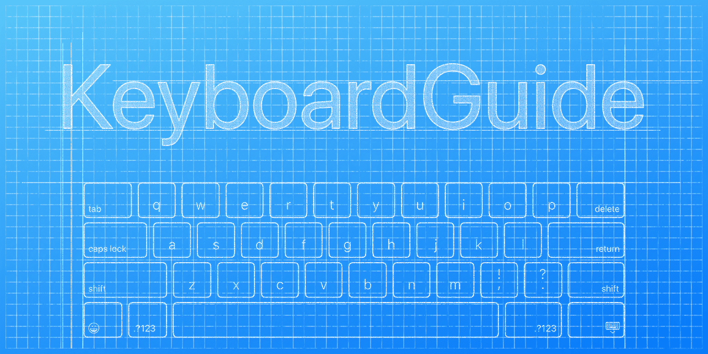

# KeyboardGuide

A modern, real iOS keyboard system notifications handler framework that Just Works.



As you know, handling the keyboard on iOS was just a nightmare.

On the internet, there are many, many iOS keyboard system notifications such as `UIResponder.keyboardWillChangeFrameNotification` (`UIKeyboardWillChangeFrameNotification`), but most of them are not implemented properly.

For example, many of them are not converting the keyboard frame in the right coordinate or not considering iPad keyboard behaviors.
Also, there are many undocumented behaviors that are not consistent between each iOS version.

This framework is solving this problem.

Based on years experience of iOS application development and various tests on each iOS version and device, it supports both Swift and Objective-C and works mostly reasonably on the latest 3 versions of iOS, which is iOS 11, 12 and iOS 13 now, and covers almost all iOS users.

## Usage

Add `import KeyboardGuide`. Create `KeyboardSafeAreaView` add to your view.
Then, lay out your subviews by adding constraints to `keyboardSafeAreaView.layoutGuide`, where represents the safe area from, not covered by the keyboard.
It works as like `safeAreaLayoutGuide` for the notch.

```
import KeyboardGuide

...

let keyboardSafeAreaView = KeyboardSafeAreaView(frame: self.view.bounds)
keyboardSafeAreaView.autoresizingMask = [.flexibleWidth, .flexibleHeight]
view.addSubview(keyboardSafeAreaView)

...

textView.bottomAnchor.constraint(equalTo: keyboardSafeAreaView.layoutGuide.bottomAnchor))
```

## Known limitations

There are a few known limitations in the current implementation.
All limitations are currently To-Do of this project.

- No SwiftUI support yet.

- Share extension can’t use this library yet because of `UIApplication` dependency.

- Objective-C code can’t `@import KeyboardGuide` by using Swift Package Manager.
  This is known, Swift Package Manager limitation and fixed by Swift 5.2, Xcode 11.4.
